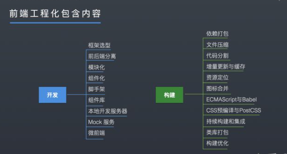
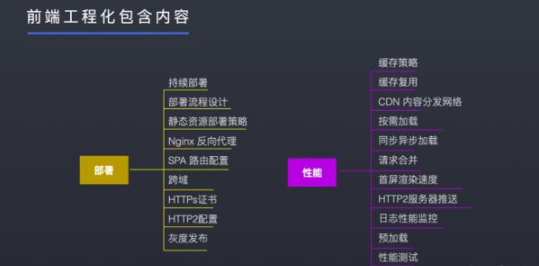
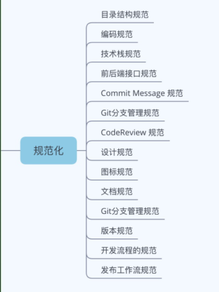
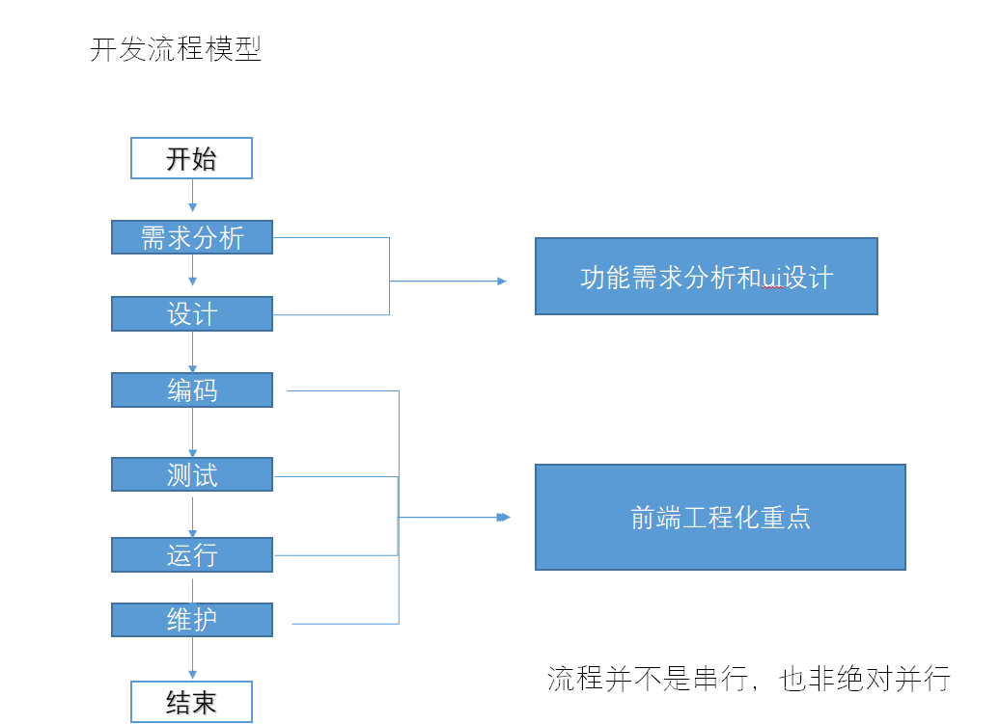

## 背景

为提高团队开发的效率和降低开发和维护成本，并让大家对整个项目有一个宏观的认识，进行前端工程化的分享，或者说是对内蒙古项目的前端生态进行讲解。包括项目从构建、开发、发布的一系列的流程。

如何提高前端的效率和降低维护成本？

    规范  分治 自动化 基建

## 工程化

- 应用计算机科学理论和技术以及工程管理原则和方法，按预**预算**与**进度**，实现满足用户要求的软件产品定义，开发和维护的工程或进行研究的科学

- 建立一个 svn/git 仓库就是一个新建了一个工程

## 前端工程化

编码 --> 发布 --> 运行 --> 维护

一切能提升前端开发效率，提高前端应用质量的手段和工具都是前端工程化。

## 开发流程模型

## 前端工程化

    开发--> 构建 --> 部署 --规范

1. 模块化

   对代码或资源的拆分（文件目录层，菜单功能模块，业务功能模块）

2. 组件化（分治）

   设计层对 ui 拆分和分治（每个组件包含独立的(HTML)+样式(CSS)+逻辑(JS)）
   每个组件对应一个工程目录，组件所需的各种资源都在这个目录下就近维护；

   注：组件间的依赖关系（（逻辑）继承、（样式）扩展、（模板）嵌套和包含等）

3. 规范化

   项目构建规范，编码规范，接口规范，组件管理规范，SVN 规范

4. 自动化

   自动化构建（npm 命令行创建自定义项目模板），自动化部署（Jenkins 进行自动化部署，nginx 反向代理，灰度发布，持续部署，spa 路由配置），自动化测试

5. 静态资源管理

6. 编译与构建

   压缩 代码分割 合并 打包 hash 增量更新与缓存 资源定位 持续构建与集成 构建优化
